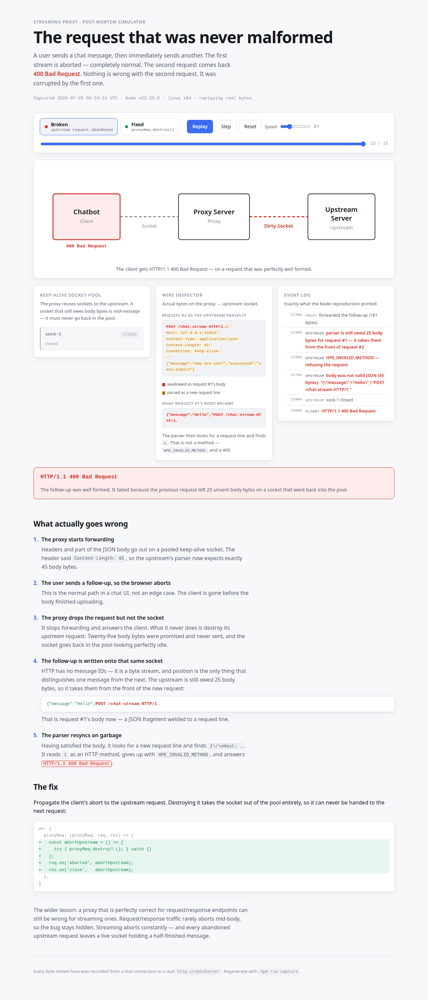

# The request that was never malformed

A chatbot user sends a message, then immediately sends another. The first stream is aborted —
completely normal. The second request comes back **`400 Bad Request`**.

Nothing is wrong with the second request. It was corrupted by the first one.

This repo reproduces that failure deterministically against a real Node HTTP server, and ships a
browser simulator that replays the captured bytes so you can watch it happen.



---

## Quick start

Nothing to install for the things that matter:

```bash
bash evidence/proof.sh       # or: npm run proof — controlled experiment, printf + nc only
node server/raw-repro.js     # or: npm run repro
node server/serve-web.js     # or: npm run sim   → http://localhost:4173
```

**[REPRODUCE.md](REPRODUCE.md) is the practical guide** — five ways to verify this yourself, from
raw bytes through `nc` to the real proxy libraries.

The shortest proof is `evidence/proof.sh`. It runs the same follow-up request three times, changing
one variable at a time:

| Case | Connection | First body | Follow-up gets |
|---|---|---|---|
| A | reused | complete | `200 OK` (twice) |
| B | new | **partial** | `200 OK` |
| C | **reused** | **partial** | **`400 Bad Request`** |

The follow-up in case C is byte-for-byte identical to case B. Only the connection it travelled on
changed. Reuse alone is fine, an abandoned request alone is fine, and the two together are the bug.

```
BROKEN — proxy abandons the upstream request on client abort
     2ms  client   user sends "Hello"
     2ms  proxy    forwarded headers + 20 of 45 body bytes
    63ms  client   user sends a follow-up; browser aborts the first request
    63ms  proxy    upstream request abandoned but never destroyed — socket returns to the pool
   124ms  pool     pool reuses sock-1 — it looks idle, but it is mid-message
   125ms  upstream parser is still owed 25 body bytes for request #1 — it takes them from the front of request #2
   127ms  upstream HPE_INVALID_METHOD — refusing the request
   129ms  upstream body was not valid JSON (45 bytes): "{\"message\":\"Hello\",\"POST /chat-stream HTTP/1."
   140ms  client   HTTP/1.1 400 Bad Request

FIXED  — proxy calls proxyReq.destroy() on client abort
    62ms  proxy    proxyReq.destroy() — upstream request torn down, socket leaves the pool
   123ms  pool     pool has no idle socket — dialled a fresh one (sock-3)
   527ms  client   HTTP/1.1 200 OK
```

---

## The mechanism

**1. The proxy starts forwarding.** Headers and part of the JSON body go out on a pooled keep-alive
socket. The header said `Content-Length: 45`, so the upstream's parser now expects exactly 45 body
bytes.

**2. The user sends a follow-up, so the browser aborts.** In a chat UI this is the normal path, not
an edge case. The client is gone before the body finished uploading.

**3. The proxy drops the request but not the socket.** It stops forwarding and answers the client.
What it never does is destroy its *upstream* request. Twenty-five body bytes were promised and never
sent, and the socket goes back in the pool looking perfectly idle.

**4. The follow-up is written onto that same socket.** HTTP has no message IDs — it is a byte
stream, and position is the only thing separating one message from the next. The upstream is still
owed 25 bytes, so it takes them off the front of the new request:

```
{"message":"Hello",POST /chat-stream HTTP/1.
└──── request #1's body ────┘└─ request #2's request line ─┘
```

That is request #1's body now: a JSON fragment welded to a request line. It fails to parse, which is
one 400.

**5. The parser resyncs on garbage.** Having satisfied the body, it looks for a new request line and
finds `1\r\nHost: …`. It reads `1` as an HTTP method, gives up with `HPE_INVALID_METHOD`, and
answers `HTTP/1.1 400 Bad Request`. That is the one the user sees.

---

## The fix

Propagate the client's abort to the upstream request. Destroying it removes the socket from the pool
entirely, so it can never be handed to the next request:

```js
on: {
  proxyReq: (proxyReq, req, res) => {
    const abortUpstream = () => {
      try { proxyReq.destroy?.(); } catch {}
    };
    req.on('aborted', abortUpstream);
    res.on('close',   abortUpstream);
  },
}
```

`express-http-proxy` exposes no hook for this, which is why streaming routes are worth moving to
`http-proxy-middleware`. For ordinary request/response endpoints `express-http-proxy` is fine — the
bug needs an abort mid-body to bite, and those endpoints rarely see one.

---

## What is real, and what is replayed

Worth being precise about, because "simulator" can mean anything:

| Component | What it actually is |
|---|---|
| `server/upstream.js` | A real `http.createServer`. The 400 comes from Node's own llhttp parser. |
| `server/raw-repro.js` | A real TCP socket, driven by hand. Real bytes, real parse error. |
| `traces/*.json` | Recordings of the above — every byte string is captured, not authored. |
| `web/` | Replays those recordings. It animates real data; it does not simulate HTTP. |
| `server/live-demo.js` | The real `express-http-proxy` and `http-proxy-middleware` libraries. |

**One deliberate liberty.** `raw-repro.js` drives the socket directly rather than through
`http.Agent`, because the agent will not hand out a socket it knows is mid-request. Defeating that
bookkeeping is exactly what a proxy does when it abandons a request without destroying it, so the
pool is modelled explicitly. Everything downstream of that — the server, the parser, the 400 — is
real.

**An honest negative result.** `npm run live` runs the scenario through the actual libraries, and
over a direct localhost hop on Node 18+ **both variants pass**: destroying the client socket tears
down the piped upstream request on its own, and both follow-ups return 200. The script says so
rather than pretending otherwise.

The explicit `destroy()` earns its keep when something holds the upstream socket open independently
of the client socket — a load balancer or TLS terminator in the middle, or a keep-alive agent under
concurrency that reuses a socket before teardown finishes. That is the configuration where the abort
does not propagate on its own, and it is the configuration `raw-repro.js` models.

---

## Scripts

| Command | Needs install | What it does |
|---|---|---|
| `npm run proof` | no | Controlled experiment with `printf` + `nc` |
| `npm run repro` | no | Both modes, real 400 and real 200 |
| `npm run repro:broken` / `:fixed` | no | One mode in isolation |
| `npm run capture` | no | Re-records `traces/` and `web/traces.js` |
| `npm run sim` | no | Serves the simulator on :4173 |
| `npm run live` | yes | The real libraries, side by side |
| `npm run test:e2e` | yes + `npx playwright install chromium` | Drives the simulator in Chromium and asserts on what renders |

`npm run test:e2e -- --shots` also writes `screenshots/`.

---

## Layout

```
evidence/
  proof.sh        controlled experiment: printf + nc, three cases
REPRODUCE.md      practical guide, five ways to verify it yourself
server/
  upstream.js     real HTTP server; SSE token stream; logs parser errors
  raw-repro.js    the reproduction — zero dependencies
  socket-tap.js   records real bytes off a socket
  capture.js      writes traces/ and web/traces.js
  live-demo.js    the real libraries, side by side
  serve-web.js    zero-dep static server
  e2e.js          Playwright test of the simulator
traces/           captured bytes, committed so the page works on a fresh clone
web/              the simulator: index.html, style.css, sim.js, traces.js
```

## Licence

MIT.
